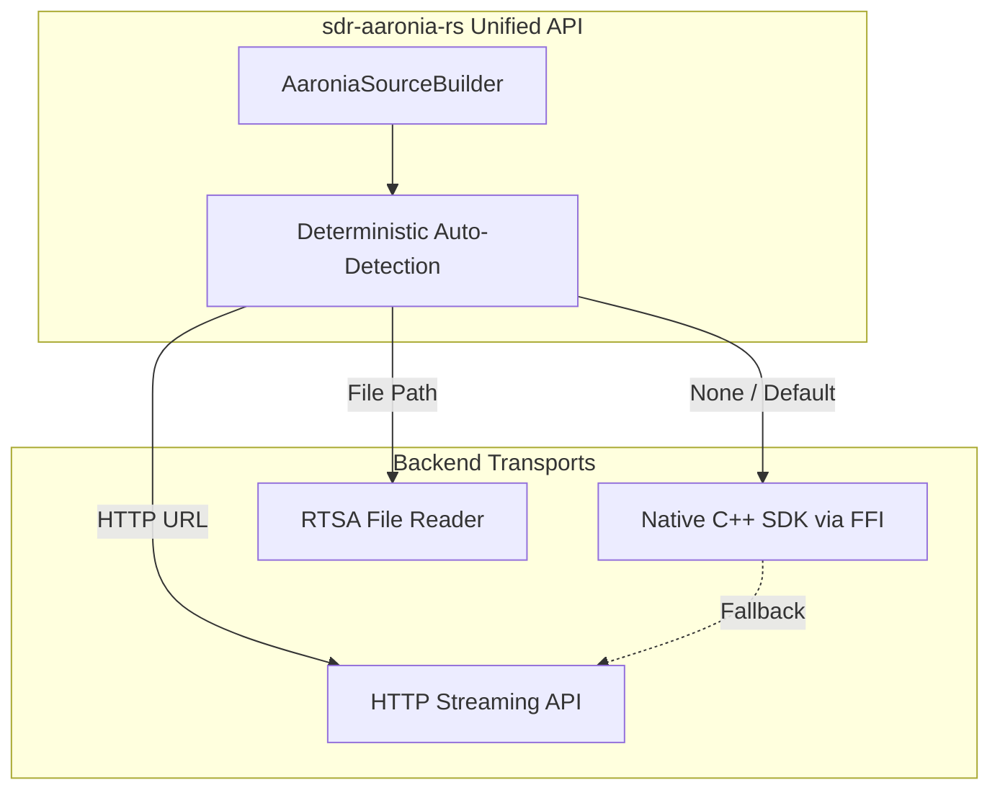

# Design: Unified Aaronia SDR Interface (sdr-aaronia-rs)

This document details the architectural design of the `sdr-aaronia-rs` crate, which provides a unified interface to Aaronia Spectran V6 devices across native SDKs, HTTP endpoints, and offline files.

## 1. Introduction

The Aaronia ecosystem offers multiple ways to access Spectran hardware (Native RTSA-Suite PRO SDK, HTTP Streaming APIs, and RTSA files). This crate wraps all three inside a single, deterministic facade (`AaroniaSource`), allowing the orchestrator to interact with Aaronia hardware without caring about the underlying transport mechanism.

## 2. System Architecture

The crate is built around an automatic source detection router that instantiates the correct backend based on the provided configuration.



### Deterministic Source Selection
The unified API (`AaroniaSource::new(config)`) enforces strict selection rules:
1. **File Source**: If the config was created via `from_file()`.
2. **HTTP Source**: If the config was created via `from_http()`.
3. **Auto-Detect**: If empty, it attempts to load the native SDK. If the native SDK library isn't found, it falls back to polling the default HTTP endpoint (`localhost:54664`).

## 3. Backend Implementations

### Native SDK
- Uses direct FFI calls into the Aaronia RTSA-Suite PRO shared libraries (`spectranv6` or `spectranv6eco`).
- **IQ Mode Constraint**: Enforces `span * 1.5 ≤ receiverclock` by reading the live device clock before streaming.
- **Data Path (RX)**: Polls `GetPacket` on the C++ side every 5 ms. Converts the raw pointer arrays to `Complex32` slices with zero-copy where structurally possible.
- **Data Path (TX)**: Provides an experimental `TxStream` API utilizing `SendPacket` for transmission (strictly hardware-unverified pending full V6 tests, as ECO lacks TX).
- **Sweep-Spectra Mode**: Configures non-IQ sweeping via `SweepsaConfig` by modifying `"main/startfreq"`, `"main/stopfreq"`, `"main/rbw"`, etc. Supports `"spectranv6/sweepsa"` and `"spectranv6eco/sweepsa"` open strings.
- **Health & GPS Telemetry**: Exposes `HealthState` and `GpsState` structs powered by a recursive configuration tree-walker (`walk_health_tree`), fetching device diagnostics dynamically.
- **Channel Hopping**: Executes channel hops by modifying the `main/centerfreq` configuration key on the open device handle, bypassing the need to restart the entire stream.

### HTTP Streaming
- Implements the V9 RTSA HTTP specification.
- Supports Basic Auth and Token-based authentication.
- **Formats**: Requests and parses the `Int16` binary stream for maximum throughput, maintaining a persistent chunked-transfer buffer.
- **Channel Hopping**: Wraps `configure_capture(frequency_center=...)` via a `PUT` request to the HTTP API. (Note: This requires the "Remote Config" software license from Aaronia to take effect).

### RTSA Files
- Maps the RTSA file format to the `SdrSource` interface.
- Extracts metadata (frequency, sample rate) directly from the file.
- Single-channel only (no channel hopping allowed).

## 4. Hardware Management

The crate also exposes lower-level builder variants (e.g., `HttpSourceBuilder`) that allow integration with `FutureSDR` block graphs. Through the `HttpEndpointsClient`, callers can fetch health telemetry, stream statistics, and device temperature, mirroring the capabilities of the desktop RTSA suite within a headless Rust process.


### **🔁 Channel Hopping & Native `sdr-source` Integration**

The `sdr-source` trait implementation (`AaroniaSdrSource`) and its associated channel hopping/dwell controllers have been completely vendored and integrated natively into the crate.

Automatic mid-stream retuning via `SourceConfig.channels_hz` is supported natively:

- **HTTP**: `AaroniaSource::set_center_frequency` wrapping `HttpEndpointsClient::configure_capture(frequency_center=Some(f))`.
  *(Requires the RTSA-Suite "Remote Config" license server-side; otherwise, the PUT returns success but is ignored).*
- **Native SDK**: Re-issuing `configure_iq_receiver` with the new center frequency, applying the change to the open device handle via the `main/centerfreq` config key (no stream restart needed).
- **File**: Re-tuning is inherently unsupported for pre-recorded captures.

Per-hop pacing utilizes the integrated `sdr_source::DwellController`, inserting a ~75 ms settle after every retune to ride out the RTSA's apply-config latency and flush stale samples from the pipeline.

### **Overrun Detection (HTTP)**

The HTTP reader task (`connect_http` in `unified_source.rs`) runs a
`DropDetector` over each packet's `start_time`/`end_time` metadata. A
timestamp gap larger than tolerance latches `AaroniaSource::pending_overrun`,
which `take_overrun()` reads and clears. `single_channel_pump` and
`hop_pump` (`sdr_source_impl.rs`) call `take_overrun()` once per emitted
`IqPacket`, so a drop detected anywhere since the last read surfaces as
`IqPacket::overrun = true` on the next packet — a per-call signal, not a
precise per-sample one, since drop timing is lost once chunks merge into
the flat `sample_buffer`. The native-SDK and file backends don't populate
this yet (`overrun` is always `false` for them); native-SDK overrun
detection would need to read `native_sdk.rs`'s `WARN_OVERFLOW`/
`WARN_DROPPED` packet flags, which is Windows/Linux-only code.

The Aaronia capture thread (`AaroniaSdrSource::start`) is wrapped in
`catch_unwind`, matching the USRP/HackRF/Pluto backends — a panic inside
the pump loop is logged rather than silently unwinding the thread.

## 🏗️ **Architecture**
### **Deterministic Source Selection Rules**

1. **📁 File Path Provided** → File source only
   - Example: `AaroniaConfig::from_file("recording.rtsa")`
   - Behavior: Uses file, fails if file missing (no fallback)
   - Platform: All platforms

2. **🌐 HTTP URL Provided** → HTTP source only
   - Example: `AaroniaConfig::from_http("http://192.168.1.100")`
   - Behavior: Uses HTTP, fails if unreachable (no fallback)
   - Platform: All platforms

3. **⚙️ Nothing Specified** → SDK → localhost:54664 fallback
   - Example: `AaroniaConfig::default().center_frequency(446.0e6)`
   - Behavior: Tries SDK first, falls back to localhost:54664
   - Platform: All platforms (SDK Windows/Linux only)

4. **🔒 Force Option** → Forced source only
   - Example: `config.force_native_sdk()`
   - Behavior: Uses forced type, fails if unavailable (no fallback)
   - Platform: Depends on forced type

### **FutureSDR Integration**

FutureSDR integration is supported under the `futuresdr` feature gate. When active, it allows for seamless block graph integration, exposing `HttpSource` as a FutureSDR source block:

```text
┌─────────────────┐    ┌────────────────────┐
│   FutureSDR     │    │  sdr-aaronia-rs    │
│   Flowgraph     │    │    (Source API)    │
├─────────────────┤    ├────────────────────┤
│ HttpSource      │◄──►│ HttpSourceBuilder  │
│ (Block)         │    │ StreamingFormats   │
│                 │    │ StreamParser       │
└─────────────────┘    └────────────────────┘
```
