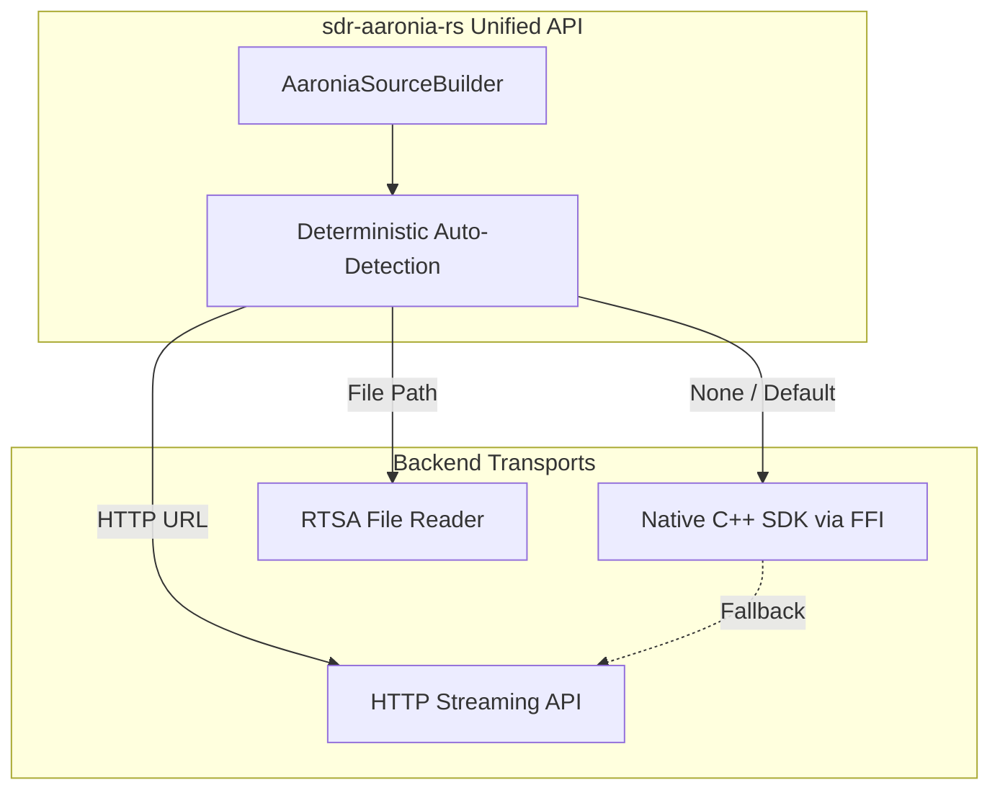

# Design: Unified Aaronia SDR Interface (sdr-aaronia-rs)

This document describes the architecture of the `sdr-aaronia-rs` crate, which provides a unified interface to Aaronia Spectran V6 devices across the native SDK, the HTTP streaming API, and offline RTSA files.

## 1. Overview

The Aaronia ecosystem offers three ways to access Spectran hardware: the native RTSA-Suite PRO SDK, the HTTP streaming API, and recorded RTSA files. This crate wraps all three behind a single deterministic facade, `AaroniaSource`, so callers can work with Aaronia hardware without depending on the underlying transport.

## 2. Architecture

The crate is built around an automatic source-detection router that instantiates the correct backend from the provided configuration.



## 3. Source Selection

`AaroniaSource::new(config)` selects a backend using strict, deterministic rules:

| Configuration | Backend | Fallback | Platforms |
|---|---|---|---|
| `AaroniaConfig::from_file("recording.rtsa")` | File | None — fails if the file is missing | All |
| `AaroniaConfig::from_http("http://192.168.1.100")` | HTTP | None — fails if unreachable | All |
| `AaroniaConfig::default()` (nothing specified) | Native SDK, when the `native-sdk` feature is enabled and the SDK library is found | Connects to the default HTTP endpoint (`http://localhost:54664`) otherwise. Since `native-sdk` is not a default feature, a stock build always resolves to HTTP. | All (SDK itself is Windows/Linux only) |
| Force option, e.g. `config.force_native_sdk()` | Forced type | None — fails if unavailable | Depends on forced type |

## 4. Backend Implementations

### 4.1 Native SDK

Available on Windows and Linux only, behind the non-default `native-sdk` feature.

- Uses direct FFI calls into the Aaronia RTSA-Suite PRO shared library (`AaroniaRTSAAPI.dll` / `libAaroniaRTSAAPI.so`). The `spectranv6` and `spectranv6eco` strings are device-family identifiers passed when enumerating and opening devices, not library names.
- **IQ mode constraint**: enforces `span * 1.5 <= receiverclock` by reading the live device clock before streaming.
- **Data path (RX)**: polls `GetPacket` on the C++ side every 5 ms. Where the packet stride allows, the raw sample buffer is reinterpreted in place as `Complex32` (no per-sample conversion) before being copied into the caller's buffer.
- **Data path (TX)**: provides an experimental `TxStream` API built on `SendPacket`. This path is hardware-unverified pending full V6 testing, as the ECO model lacks TX.
- **Sweep-spectra mode**: configures non-IQ sweeping via `SweepsaConfig` by modifying `"main/startfreq"`, `"main/stopfreq"`, `"main/rbw"`, and related keys (these config paths are inferred from the SDK naming convention and are hardware-unverified). Supports the `"spectranv6/sweepsa"` and `"spectranv6eco/sweepsa"` open strings.
- **Health and GPS telemetry**: exposes `HealthState` and `GpsState` structs populated by a recursive configuration tree-walker (`walk_health_tree`) that fetches device diagnostics dynamically. Not yet exercised against live hardware.

### 4.2 HTTP Streaming

- Implements the V9 RTSA HTTP specification.
- Supports Basic Auth and token-based authentication.
- **Formats**: supports the `Json`, `Int16`, `Float16`, and `Float32` wire formats, maintaining a persistent chunked-transfer buffer across packet boundaries. The default is `Float32` (binary, lossless); `Int16` is opt-in via `AaroniaConfig::stream_format()` / `stream_scale()`.
- Beyond streaming, `HttpEndpointsClient` exposes device control and health telemetry (as a generic configuration tree) within a headless Rust process.

### 4.3 RTSA Files

- Maps the RTSA file format to the `SdrSource` interface.
- Extracts metadata (frequency, sample rate) directly from the file.
- Single-channel only; retuning is inherently unsupported for pre-recorded captures.

## 5. Channel Hopping and Dwell Control

Under the `sdr-source` feature, `AaroniaSdrSource` (in `sdr_source_impl.rs`) implements the `SdrSource` trait from the external `orecchiette-sdr-source-rs` crate, which the crate re-exports as `sdr_source`. Automatic mid-stream retuning via `SourceConfig.channels_hz` is supported per backend:

- **Native SDK**: re-issues `configure_iq_receiver` with the new center frequency, applying the change to the open device handle via the `main/centerfreq` configuration key. No stream restart is required.
- **HTTP**: `AaroniaSource::set_center_frequency` wraps `HttpEndpointsClient::configure_capture` as a `PUT` to the license-free `/control` endpoint, always sending the complete capture tuple (center, span, reference level) with unchanged values filled from the cached config. The full tuple is required: RTSA servers silently ignore a capture `PUT` carrying only one of the two frequency fields (it returns `{"success":true}` but the device stays put — live-verified). The RTSA-Suite "Remote Config" license gates the separate `/remoteconfig` write path, which the hopping code deliberately avoids — hopping is not gated on the license probe.
- **File**: not supported.

Hop dwell deadlines come from `sdr_source::DwellController`; per-hop pacing additionally inserts a ~75 ms settle after every retune (`RETUNE_SETTLE` in `sdr_source_impl.rs`) to ride out the RTSA's apply-config latency and flush stale samples from the pipeline.

## 6. Overrun Detection and Fault Handling

The HTTP reader task (spawned by `init_http_source` in `unified_source.rs`) runs a `DropDetector` over each packet's `start_time`/`end_time` metadata. A timestamp gap larger than the tolerance latches `AaroniaSource::pending_overrun`, which `take_overrun()` reads and clears. `single_channel_pump` and `hop_pump` (`sdr_source_impl.rs`) call `take_overrun()` once per emitted `IqPacket`, so a drop detected anywhere since the last read surfaces as `IqPacket::overrun = true` on the next packet. This is a per-call signal, not a precise per-sample one, since drop timing is lost once chunks merge into the flat `sample_buffer`.

The native-SDK and file backends do not populate this yet (`overrun` is always `false` for them). Native-SDK overrun detection would need to read the overflow/dropped warning bits from the packet `flags` field, which the RX path currently ignores.

The Aaronia capture thread (`AaroniaSdrSource::start`) is wrapped in `catch_unwind`: a panic inside the pump loop is logged rather than silently unwinding the thread.

## 7. FutureSDR Integration

FutureSDR integration is available under the `futuresdr` feature gate. The crate exposes lower-level builder variants (e.g. `HttpSourceBuilder`) so `HttpSource` can be used as a source block in FutureSDR flowgraphs:

```text
┌─────────────────┐    ┌────────────────────┐
│   FutureSDR     │    │  sdr-aaronia-rs    │
│   Flowgraph     │    │    (Source API)    │
├─────────────────┤    ├────────────────────┤
│ HttpSource      │◄──►│ HttpSourceBuilder  │
│ (Block)         │    │ StreamFormat       │
│                 │    │ StreamParser       │
└─────────────────┘    └────────────────────┘
```
