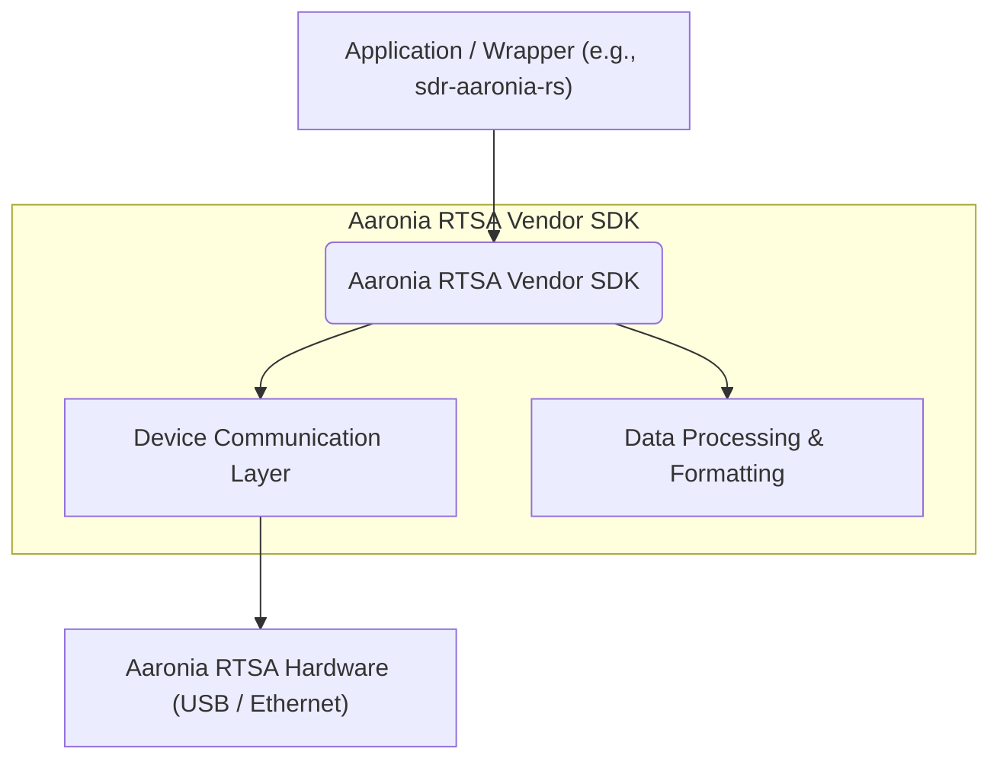

# Aaronia RTSA Vendor SDK Integration Specification

## Overview

The Aaronia Real-Time Spectrum Analyzer (RTSA) Vendor Software Development Kit (SDK) provides the foundational libraries and APIs for direct interaction with Aaronia RTSA hardware and software components. This document outlines the expected functionalities, typical architecture, and integration considerations for developers utilizing the official Aaronia SDK, particularly when building higher-level wrappers or applications.

This specification focuses on how external applications can interface with the vendor-provided SDK, covering device control, and data acquisition functionalities. It serves as a guide for understanding the vendor SDK's capabilities and how to effectively integrate it into custom solutions.

> **Status & attribution.** This document is a *community-compiled* reference, **not** an official Aaronia specification. It is assembled from Aaronia's official open-source sample code, public posts on the Aaronia V6 forum, vendor SDK headers, and empirical analysis. Where these disagree, the vendor's own materials are authoritative. See [Sources and Attribution](#sources-and-attribution) for the upstream, vendor-published references.

## Table of Contents

- [Features and Purpose](#features-and-purpose)
- [Verified Architecture](#verified-architecture)
- [Core API Components](#core-api-components)
  - [Initialization and Shutdown](#initialization-and-shutdown)
  - [Device Management API](#device-management-api)
  - [Configuration API](#configuration-api)
  - [Data Acquisition API](#data-acquisition-api)
  - [File I/O API](#file-io-api)
  - [Data Structures and Enums](#data-structures-and-enums)
  - [Return Codes and States](#return-codes-and-states)
- [Rust Binding Notes](#rust-binding-notes)
- [Integration Patterns](#integration-patterns)
  - [Device Connection and Control](#device-connection-and-control)
  - [Real-time Data Streaming (RAW Mode)](#real-time-data-streaming-raw-mode)
  - [Real-time Data Streaming (IQ Receiver Mode)](#real-time-data-streaming-iq-receiver-mode)
  - [Exploring Device Configuration](#exploring-device-configuration)
- [Error Handling](#error-handling)
- [Performance Considerations](#performance-considerations)
- [Integration Guidelines](#integration-guidelines)
- [Licensing Considerations](#licensing-considerations)
- [Related Specifications](#related-specifications)
- [Sources and Attribution](#sources-and-attribution)

## Features and Purpose

The Aaronia RTSA Vendor SDK provides low-level, high-performance access to Aaronia RTSA devices. Based on analysis of the SDK samples, its verified features include:

*   **Hardware Abstraction**: Unified interface to SpectranV6 hardware models via USB connection
*   **Device Control**: Configuration APIs for parameters including:
    *   Center frequency (`main/centerfreq`)
    *   Span frequency (`main/spanfreq`)
    *   Reference level (`main/reflevel`)
    *   Receiver channel selection (`device/receiverchannel`)
    *   Receiver clock speed (`device/receiverclock`)
    *   Output format (`device/outputformat`)
    *   Decimation settings (`main/decimation`)
*   **Real-time Data Access**: Packet-based streaming of IQ samples and spectrum data with configurable decimation
*   **Device Modes**: Verified support for multiple operational modes:
    *   **SpectranV6**: `spectranv6/raw`, `spectranv6/iqreceiver`, `spectranv6/iqtransceiver`, `spectranv6/iqtransmitter`, `spectranv6/sweepsa`
    *   **SpectranV6 ECO**: `spectranv6eco/raw`, `spectranv6eco/iqreceiver`, `spectranv6eco/iqtransceiver`, `spectranv6eco/iqtransmitter`, `spectranv6eco/sweepsa`
*   **Configuration Tree**: Hierarchical configuration system with verified parameters:
    *   **Clock Rates** (V6): 46MHz (46.08), 61MHz (61.44), 76MHz (76.80), 92MHz (92.16), 122MHz (122.88), 184MHz (184.32), 245MHz (245.76), 492MHz (491.52) — see the full label table under [Rust Binding Notes](#rust-binding-notes)
    *   **Clock Rates** (V6 ECO): fixed at 92.16 MHz. Its top IQ rate is 61.44 MHz, which is that clock over 1.5 — the two are easy to confuse and this document once recorded the rate as the clock
    *   **Decimation**: Full, 1/2, 1/4, 1/8, 1/16, 1/32, 1/64, 1/128, 1/256, 1/512
    *   **IQ Mode Sample Rate**: equal to `spanfreq` (constraint: `spanfreq ≤ receiverclock / 1.5`). Measured on a V6 ECO, untested on a full V6, and not obviously consistent with Aaronia's own 245 MHz / 250 Msample figures for the V6 — see [HTTPSPEC](HTTPSPEC.md#unresolved-the-full-v6s-top-rate)
*   **Health Monitoring**: Real-time device status including temperatures, sample rates, power levels, USB statistics, GPS data

The SDK is designed for building custom spectrum analysis applications, SDR integration, and specialized RF measurement tools.

## Verified Architecture

**Based on SDK samples and documentation analysis:**

The Aaronia RTSA Vendor SDK is typically provided as a native library (e.g., `.dll` on Windows, `.so` on Debian 12 Linux) with a well-defined C/C++ API. Higher-level language bindings (e.g., C#, Python, Java) would then wrap this native library.



*   **Device Communication Layer**: Manages the physical connection and data transfer with RTSA hardware.
*   **Data Processing & Formatting**: Handles the internal representation and initial processing of raw measurement data (IQ, spectra) from the device.

## Core API Components

The Aaronia RTSA SDK (`aaroniartsaapi.h`) exposes a C-style API for maximum compatibility. All functions return an `AARTSAAPI_Result` indicating success or failure.

### Initialization and Shutdown

**Verified API functions from `aaroniartsaapi.h`:**

*   **`AARTSAAPI_Init(uint32_t memory)`**: Initialize SDK with memory allocation level:
    *   `AARTSAAPI_MEMORY_SMALL` (0)
    *   `AARTSAAPI_MEMORY_MEDIUM` (1) - **Recommended for samples**
    *   `AARTSAAPI_MEMORY_LARGE` (2)
    *   `AARTSAAPI_MEMORY_LUDICROUS` (3)
*   **`AARTSAAPI_Init_With_Path(uint32_t memory, const wchar_t * pathXmlLocation)`**: Initialize with XML configuration path (required for samples)
*   **`AARTSAAPI_Shutdown(void)`**: Cleanup and shutdown - **mandatory before termination**
*   **`AARTSAAPI_Version(void)`**: Returns version (upper 16 bits major, lower 16 bits revision)

### Device Management API

*   **`AARTSAAPI_Handle`**: An opaque handle representing an API access session.
*   **`AARTSAAPI_Device`**: An opaque handle representing an opened device.
*   **`AARTSAAPI_Open(AARTSAAPI_Handle * handle)`**: Opens a new API access handle.
*   **`AARTSAAPI_Close(AARTSAAPI_Handle * handle)`**: Closes an API access handle.
*   **`AARTSAAPI_DeviceInfo`**: Device identification structure (verified from header):
    *   `cbsize` (`int64_t`): Structure size - **must be set to `sizeof(AARTSAAPI_DeviceInfo)`**
    *   `serialNumber` (`wchar_t[120]`): Device serial number
    *   `ready` (`bool`): Device ready and booted
    *   `boost` (`bool`): Has second USB connector (V6 feature)
    *   `superspeed` (`bool`): Uses USB 3.0+ superspeed
    *   `active` (`bool`): Already in use by another application
*   **`AARTSAAPI_RescanDevices(AARTSAAPI_Handle * handle, int timeout)`**: Rescans for connected devices. Should be repeated if `AARTSAAPI_RETRY` is returned.
*   **`AARTSAAPI_ResetDevices(AARTSAAPI_Handle * handle)`**: Resets all currently unused devices. `AARTSAAPI_RescanDevices` should be called afterwards.
*   **`AARTSAAPI_EnumDevice(AARTSAAPI_Handle * handle, const wchar_t * type, int32_t index, AARTSAAPI_DeviceInfo * dinfo)`**: Enumerates devices of a specific `type` (e.g., `L"spectranv6"`, `L"spectranv6eco"`). Returns `AARTSAAPI_EMPTY` when the list ends.
*   **`AARTSAAPI_OpenDevice(AARTSAAPI_Handle * handle, AARTSAAPI_Device * dhandle, const wchar_t * type, const wchar_t * serialNumber)`**: Opens a device for exclusive use. `type` can specify mode (e.g., `L"spectranv6/raw"`, `L"spectranv6eco/iqreceiver"`).
*   **`AARTSAAPI_CloseDevice(AARTSAAPI_Handle * handle, AARTSAAPI_Device * dhandle)`**: Closes an opened device.
*   **`AARTSAAPI_ConnectDevice(AARTSAAPI_Device * dhandle)`**: Connects to the physical device.
*   **`AARTSAAPI_DisconnectDevice(AARTSAAPI_Device * dhandle)`**: Disconnects from the physical device.
*   **`AARTSAAPI_StartDevice(AARTSAAPI_Device * dhandle)`**: Starts data acquisition/transmission.
*   **`AARTSAAPI_StopDevice(AARTSAAPI_Device * dhandle)`**: Stops data acquisition/transmission.
*   **`AARTSAAPI_GetDeviceState(AARTSAAPI_Device * dhandle)`**: Retrieves the current operational state of the device.

### Configuration API

**Hierarchical configuration system verified from SDK samples:**

*   **`AARTSAAPI_Config`**: Opaque handle for configuration tree navigation
*   **`AARTSAAPI_ConfigType`** (enum from header):
    *   `AARTSAAPI_CONFIG_TYPE_OTHER` (0)
    *   `AARTSAAPI_CONFIG_TYPE_GROUP` (1) - Container for other config items
    *   `AARTSAAPI_CONFIG_TYPE_BLOB` (2)
    *   `AARTSAAPI_CONFIG_TYPE_NUMBER` (3) - Float/double values
    *   `AARTSAAPI_CONFIG_TYPE_BOOL` (4)
    *   `AARTSAAPI_CONFIG_TYPE_ENUM` (5) - Selection from predefined options
    *   `AARTSAAPI_CONFIG_TYPE_STRING` (6)
*   **`AARTSAAPI_ConfigInfo`**: Configuration metadata (verified structure):
    *   `cbsize` (`int64_t`): **Must be set to `sizeof(AARTSAAPI_ConfigInfo)`**
    *   `name` (`wchar_t[80]`): Internal name (e.g., `L"centerfreq"`)
    *   `title` (`wchar_t[120]`): Display name (e.g., `L"Center Frequency"`)
    *   `type` (`AARTSAAPI_ConfigType`): Value type
    *   **Numeric constraints**: `minValue`, `maxValue`, `stepValue` (`double`)
    *   `unit` (`wchar_t[10]`): Unit string (e.g., `L"Frequency"`)
    *   `options` (`wchar_t[1000]`): Semicolon-separated enum choices
    *   `disabledOptions` (`uint64_t`): Bitfield of disabled options
*   **`AARTSAAPI_ConfigRoot(AARTSAAPI_Device * dhandle, AARTSAAPI_Config * config)`**: Gets the root of the configuration tree.
*   **`AARTSAAPI_ConfigHealth(AARTSAAPI_Device * dhandle, AARTSAAPI_Config * config)`**: Gets the root of the health/status tree and updates its values.
*   **`AARTSAAPI_ConfigFirst(AARTSAAPI_Device * dhandle, AARTSAAPI_Config * group, AARTSAAPI_Config * config)`**: Gets the first child of a group config item.
*   **`AARTSAAPI_ConfigNext(AARTSAAPI_Device * dhandle, AARTSAAPI_Config * group, AARTSAAPI_Config * config)`**: Advances to the next child of a group config item.
*   **`AARTSAAPI_ConfigFind(AARTSAAPI_Device * dhandle, AARTSAAPI_Config * group, AARTSAAPI_Config * config, const wchar_t * name)`**: Finds a config item by a forward-slash-separated path (e.g., `L"main/centerfreq"`).
*   **`AARTSAAPI_ConfigGetName(AARTSAAPI_Device * dhandle, AARTSAAPI_Config * config, wchar_t * name)`**: Gets the internal name of a config item.
*   **`AARTSAAPI_ConfigGetInfo(AARTSAAPI_Device * dhandle, AARTSAAPI_Config * config, AARTSAAPI_ConfigInfo * cinfo)`**: Gets metadata for a config item.
*   **`AARTSAAPI_ConfigSetFloat(AARTSAAPI_Device * dhandle, AARTSAAPI_Config * config, double value)`**: Sets a floating-point value for a config item.
*   **`AARTSAAPI_ConfigGetFloat(AARTSAAPI_Device * dhandle, AARTSAAPI_Config * config, double * value)`**: Gets a floating-point value from a config item.
*   **`AARTSAAPI_ConfigSetString(AARTSAAPI_Device * dhandle, AARTSAAPI_Config * config, const wchar_t *value)`**: Sets a string value for a config item.
*   **`AARTSAAPI_ConfigGetString(AARTSAAPI_Device * dhandle, AARTSAAPI_Config * config, wchar_t * value, int64_t * size)`**: Gets a string value from a config item.
*   **`AARTSAAPI_ConfigSetInteger(AARTSAAPI_Device * dhandle, AARTSAAPI_Config * config, int64_t value)`**: Sets an integer value for a config item.
*   **`AARTSAAPI_ConfigGetInteger(AARTSAAPI_Device * dhandle, AARTSAAPI_Config * config, int64_t * value)`**: Gets an integer value from a config item.

### Data Acquisition API

*   **`AARTSAAPI_Packet`**: Data packet structure (verified from header):
    *   `cbsize` (`int64_t`): **Must be set to `sizeof(AARTSAAPI_Packet)`**
    *   `streamID` (`uint64_t`), `flags` (`uint64_t`): Stream identification and control flags
    *   **Timing**: `startTime`, `endTime` (seconds since Unix epoch)
    *   **Frequency Info**: `startFrequency` (lower edge of the packet's frequency span; for IQ packets `center − span/2`), `stepFrequency` (sample rate), `spanFrequency`, `rbwFrequency`
    *   **Sample Data**: `num` (samples in packet), `total` (total samples), `size`, `stride`
    *   **Data Pointer**: `fp32` (float* - IQ pairs as I,Q,I,Q... or spectrum data)
    *   `interleave` (`int64_t`): Channel interleaving information
*   **Packet Flags** (verified from header):
    *   `AARTSAAPI_PACKET_STREAM_START` (0x0000000000000001ULL)
    *   `AARTSAAPI_PACKET_STREAM_END` (0x0000000000000002ULL)
    *   `AARTSAAPI_PACKET_SEGMENT_START` (0x0000000000000004ULL)
    *   `AARTSAAPI_PACKET_SEGMENT_END` (0x0000000000000008ULL)
    *   `AARTSAAPI_PACKET_PUSH` (0x0000000000008000ULL)
*   **`AARTSAAPI_AvailPackets(AARTSAAPI_Device * dhandle, int32_t channel, int32_t * num)`**: Gets the number of available packets in a specified data `channel`.
*   **`AARTSAAPI_GetPacket(AARTSAAPI_Device * dhandle, int32_t channel, int32_t index, AARTSAAPI_Packet * packet)`**: Retrieves a specific packet from the output queue.
*   **`AARTSAAPI_ConsumePackets(AARTSAAPI_Device * dhandle, int32_t channel, int32_t num)`**: Consumes (removes) a number of packets from the data channel. Essential to prevent blocking and data drops.
*   **`AARTSAAPI_GetMasterStreamTime(AARTSAAPI_Device * dhandle, double * stime)`**: Gets the current master stream time.
*   **`AARTSAAPI_SendPacket(AARTSAAPI_Device * dhandle, int32_t channel, const AARTSAAPI_Packet * packet)`**: Sends a packet to an inbound channel (for transmission modes).

### File I/O API

**Note**: Based on SDK sample analysis, the core AARTSAAPI focuses exclusively on live device interaction. RTSA file I/O is handled by separate components not exposed through the main device control API.


### Data Structures and Enums

*   **`AARTSAAPI_Result`**: `uint32_t` for return codes.
*   **`AARTSAAPI_Handle`, `AARTSAAPI_Device`, `AARTSAAPI_Config`**: Opaque pointers for managing API sessions, devices, and configuration items.
*   **`AARTSAAPI_DeviceInfo`**: Device identification and status.
*   **`AARTSAAPI_ConfigType`**: Enumerates types of configuration values.
*   **`AARTSAAPI_ConfigInfo`**: Metadata for configuration items.
*   **`AARTSAAPI_Packet`**: Contains measurement data and associated metadata.

### Return Codes and States

The `AARTSAAPI_Result` type indicates the outcome of API calls.

*   **Success Codes**:
    *   `AARTSAAPI_OK` (0x00000000): Operation successful.
    *   `AARTSAAPI_EMPTY` (0x00000001): No more items (e.g., during enumeration).
    *   `AARTSAAPI_RETRY` (0x00000002): Operation should be retried (e.g., `RescanDevices`).
*   **Device State Codes**:
    *   `AARTSAAPI_IDLE` (0x10000000)
    *   `AARTSAAPI_CONNECTING` (0x10000001)
    *   `AARTSAAPI_CONNECTED` (0x10000002)
    *   `AARTSAAPI_STARTING` (0x10000003)
    *   `AARTSAAPI_RUNNING` (0x10000004)
    *   `AARTSAAPI_STOPPING` (0x10000005)
    *   `AARTSAAPI_DISCONNECTING` (0x10000006)
*   **Warning Codes**:
    *   `AARTSAAPI_WARNING` (0x40000000)
    *   `AARTSAAPI_WARNING_VALUE_ADJUSTED` (0x40000001)
    *   `AARTSAAPI_WARNING_VALUE_DISABLED` (0x40000002)
*   **Error Codes**:
    *   `AARTSAAPI_ERROR` (0x80000000)
    *   `AARTSAAPI_ERROR_NOT_INITIALIZED` (0x80000001)
    *   `AARTSAAPI_ERROR_NOT_FOUND` (0x80000002)
    *   `AARTSAAPI_ERROR_BUSY` (0x80000003)
    *   `AARTSAAPI_ERROR_NOT_OPEN` (0x80000004)
    *   `AARTSAAPI_ERROR_NOT_CONNECTED` (0x80000005)
    *   `AARTSAAPI_ERROR_INVALID_CONFIG` (0x80000006)
    *   `AARTSAAPI_ERROR_BUFFER_SIZE` (0x80000007)
    *   `AARTSAAPI_ERROR_INVALID_CHANNEL` (0x80000008)
    *   `AARTSAAPI_ERROR_INVALID_PARAMETR` (0x80000009)
    *   `AARTSAAPI_ERROR_INVALID_SIZE` (0x8000000a)
    *   `AARTSAAPI_ERROR_MISSING_PATHS_FILE` (0x8000000b)
    *   `AARTSAAPI_ERROR_VALUE_INVALID` (0x8000000c)
    *   `AARTSAAPI_ERROR_VALUE_MALFORMED` (0x8000000d)

## Rust Binding Notes

The Rust bindings in `sdr-aaronia-rs::native_sdk` mirror the C API closely, with
a few helpers that bake in the patterns the official samples expect:

### Family vs. mode-qualified device strings

`AARTSAAPI_EnumDevice` takes the bare device family (`L"spectranv6"`,
`L"spectranv6eco"`); `AARTSAAPI_OpenDevice` takes the mode-qualified form
(`L"spectranv6/raw"`, `L"spectranv6eco/iqreceiver"`). Passing a mode-
qualified string to enumeration causes the SDK to silently return zero
devices. The Rust binding's `NativeSdkClient::enum_device` logs a `warn!`
when called with a string containing `/` so the regression is visible.

```rust
// Wrong: hides hardware from discovery.
let devices = source.find_devices("spectranv6/raw")?;
// Right: enumerate by family, then open by mode.
let devices = source.find_devices("spectranv6")?;
source.open_device("spectranv6/raw", &serial_wide)?;
```

### IQ-mode receiver clock constraint

`NativeSdkSource::configure_iq_receiver` calls
`utils::validate_iq_mode(span, clock)` after applying the config,
where `clock` is read live from `device/receiverclock` via
`AARTSAAPI_ConfigGetString` (or `DEFAULT_RECEIVER_CLOCK_HZ`, 92.16 MHz,
on eco devices, which expose no such key and run at a fixed clock). The check enforces
`span * 1.5 <= clock` and returns a typed error before the device starts.

The ConfigItem labels the SDK exposes are *rounded* — `"92MHz"` is
actually 92.16 MHz, etc. Use `receiver_clock_for_label` to convert.

| Label    | Actual rate    | Source              |
|----------|----------------|---------------------|
| `46MHz`  | 46.08 MHz      | README + ConfigTree |
| `61MHz`  | 61.44 MHz      | README + ConfigTree |
| `76MHz`  | 76.80 MHz      | README              |
| `77MHz`  | 76.80 MHz      | ConfigTree (alias)  |
| `92MHz`  | 92.16 MHz      | README + ConfigTree |
| `122MHz` | 122.88 MHz     | README + ConfigTree |
| `184MHz` | 184.32 MHz     | ConfigTree          |
| `245MHz` | 245.76 MHz     | README + ConfigTree |
| `492MHz` | 491.52 MHz     | ConfigTree          |

The eco family runs at a fixed clock and does not expose the
`device/receiverclock` config key — `configure_iq_receiver` skips the
write on that family (see `DeviceOpenMode::EcoIqReceiver`) and uses
`DEFAULT_RECEIVER_CLOCK_HZ`, 92.16 MHz. Its top IQ rate is 61.44 MHz,
which is that clock over 1.5; do not confuse the two.

### `read_samples` polling cadence

The official IQReceiverEco / RawIQ / SweepSpectrumEco samples poll
`AARTSAAPI_GetPacket` with 5 ms sleeps until a packet arrives. The Rust
`NativeSdkSource::read_samples` does the same and additionally caps the
total wait at 500 ms (`READ_POLL_INTERVAL` / `READ_POLL_DEADLINE`
constants), so a stalled device can't deadlock the caller. For
non-blocking liveness checks, prefer `avail_packets` (an `unsafe` call
taking `&mut` device and the channel index).

### Open-mode-aware config writes

`configure_iq_receiver` gates the three `device/*` keys
(`device/receiverchannel`, `device/outputformat`, `device/receiverclock`)
on modes that support them; `main/decimation` is written only by the
typed `set_decimation_factor(factor)` helper, which requires `Raw` mode
and validates that `factor` is a power of two in `[1, 512]`. The open
mode is recorded in `NativeSdkSource::open_mode()` (`DeviceOpenMode::Raw`,
`EcoIqReceiver`, `Sweepsa`, `EcoSweepsa`, or `Other(...)`).

The valid decimation enum is documented in the official samples README:
`Full`, `1 / 2`, `1 / 4`, `1 / 8`, `1 / 16`, `1 / 32`, `1 / 64`,
`1 / 128`, `1 / 256`, `1 / 512`. The integer index is `log2(factor)` —
index 0 is `Full` (no decimation), index 6 is `1 / 64` (per RawIQ.cpp:142
which calls `AARTSAAPI_ConfigSetInteger(&d, &config, 6)`), and the
maximum is index 9 = `1 / 512`. Resulting sample rate is
`receiverclock / factor`.

### Receiver channel selection and dual-channel capture

The full SPECTRAN V6 has two RF inputs; `device/receiverchannel`
selects `"Rx1"`, `"Rx2"`, or `"Rx1+Rx2"` (strings per the official
samples). The binding models this as `RxChannel` (defined ungated in
`utils.rs`, re-exported at the crate root and from `native_sdk`) and
threads it through every configuration surface:

*   `NativeSdkSource::configure_iq_receiver(center, span, ref,
    channel)` — the channel is a *parameter* of every (re)configuration
    rather than a follow-up call, so a mid-stream retune (e.g.
    `AaroniaSource::set_center_frequency`) re-applies the selection
    instead of silently reverting the device to `Rx1`. `None` keeps the
    `Rx1` default; an explicit selection on a non-raw open mode (or a
    device without the key) is a hard error.
*   `NativeSdkSource::set_receiver_channel(RxChannel)` — the direct,
    raw-mode-only runtime setter (errors on other open modes).
*   `SdkConfig::receiver_channel: Option<RxChannel>` — passed through
    by `SdkSource::start_streaming`.
*   `AaroniaConfig::receiver_channel(RxChannel)` — unified-source
    builder equivalent, passed through by `init_native_sdk` and every
    retune.

In `Rx1+Rx2` mode the SDK interleaves both receivers into one packet:
each sample occupies `stride` floats laid out `[I1, Q1, I2, Q2, ...pad]`.
`NativeSdkSource::read_samples_dual(rx1, rx2, max)` (wrapped by
`SdkSource::read_samples_dual` and `AaroniaSource::read_samples_dual`)
demuxes that layout into two time-aligned `Complex32` streams with the
same whole-packet carry-over rule as `read_samples`; the demux itself
is the pure `utils::deinterleave_dual_iq`, unit- and Miri-tested. A
packet whose `stride < 4` fails with a "set device/receiverchannel to
Rx1+Rx2?" hint rather than silently duplicating a channel. A streaming
session latches onto whichever read path its first call uses — mixing
`read_samples` and `read_samples_dual` on one stream would punch
time-gaps into both outputs (each consumes whole packets the other
never sees), so the second path errors instead of corrupting silently.
`stop_streaming` clears both carry buffers and the latch, so a
restarted session starts clean.

> **Hardware-unverified:** like the rest of the `Rx2`/`Rx1+Rx2` paths,
> the interleave layout follows the packet contract (`stride` = floats
> from sample to sample), not a live dual-channel capture — the
> development device is a single-channel V6 ECO. Verify against a full
> V6 before production use.

### Per-mode IQ scaling

The samples reveal that the f32 components in `AARTSAAPI_Packet::fp32`
are in volts but the *full-scale magnitude depends on the open mode*:
roughly ±10 mV on `spectranv6eco/iqreceiver` (IQReceiverEco.cpp:48 uses
`* 5 * 1000`) and ±1 mV on `spectranv6/raw` (RawIQ.cpp:48 uses
`* 50 * 1000`). Callers that need physical units must consult
`NativeSdkSource::open_mode()`.

### USB pipe is FPGA-fixed at f32

Per the official Aaronia forum thread "Receiving data in reduced format"
(answered by AdminTC, 2025-10-24):

> This indeed is not possible since the IQ streaming from the SPECTRAN
> device itself is fixed. Since there are no extra resources available
> within the FPGA no changes will be available in future (e.g. adding a
> data type switch). Some future products will use bigger FPGAs which
> will allow multiple data formats.

So: **the int16 / float16 stream formats only exist on the HTTP server
side**. The native SDK over USB always emits 32-bit floats (Complex32).
Callers wanting denser int16 traffic must connect to the HTTP server
block at `/stream?format=int16` instead of the native SDK.

### Result codes have human-readable names

Every `Err` we surface from the native SDK includes the symbolic name
from the official `AARTSAAPI_Result` enum: errors are wrapped as
`Error::SdkApi { operation, code }`, which renders as e.g.
`"SDK error during ConfigSetFloat: buffer size"` for `0x80000007`. The
full code table is exposed via `native_sdk::result_message(code)` and
matches the third-party `g3gg0/rx-fft` C# binding which provides the
canonical reference.

### Two HTTP control endpoints — RTSA app vs HTTP server block

Per the forum thread "Close RTSA application with an api" (resolved
2025-05-14), there are *two* HTTP control surfaces:

1. The RTSA application's own HTTP control port — accepts
   `PUT /app/process` with `{"running": false}` to gracefully shut
   the application down. Exposed via
   `HttpEndpointsClient::shutdown_application`.
2. The HTTP server *block* embedded in a mission's block graph —
   listens on a separate port and accepts the streaming/recording
   control endpoints documented elsewhere in this spec.

Sending a shutdown PUT to the wrong endpoint is a common confusion
point — both look like normal RTSA REST endpoints but only the first
will close the application.

### Native SDK pulls in massive Qt + ffmpeg dependencies

Per the forum thread "Notes on using the SPECTRAN V6 DLL" (Aaronia
admin response, 2025-12-22): the `libAaroniaRTSAAPI.so` / DLL is
"basically just an API-Version of the RTSA Spectran V6 block with a
few tweaks (e.g. to support sweeping)" — it transitively links the
entire RTSA application's Qt5/Qt6 stack plus `libavcodec`,
`libavformat`, `libmp3lame`, etc. There is no slimmer "USB driver
only" build available, and the admins explicitly said attempting to
strip those would require a full rewrite of the device interface code.

### Windows SDK log file

The Windows SDK writes a debug log to
`%APPDATA%\Aaronia AG\Aaronia RTSA-Suite PRO\logDebug` — useful for
post-mortem when the binding returns `AARTSAAPI_ERROR_*` and the API
itself doesn't surface any further detail.

### No dedicated DLL manual

Aaronia's official guidance (forum thread, 2025): the DLL has no
dedicated manual; the recommended path for discovering valid config
keys is to run the `ConfigTree` sample against your specific open mode
and walk the tree printed at startup.

### Useful config keys observed in third-party SDR plugins

The SDR++ `spectran_source` plugin and SDRangel `aaroniartsainput`
plugin set additional config keys we don't currently surface as typed
helpers but that callers may write via `set_config_string`:

| Key | Values | Notes |
|---|---|---|
| `device/usbcompression` | `auto`, `compressed`, `raw` | USB-bandwidth tradeoff. `auto` is the default. |
| `device/gaincontrol` | `manual`, `peak`, `power` | AGC mode. `manual` lets the host pin gain. |
| `device/lowpower` | `true`, `false` | Power-saving toggle. |
| `device/dspbufmode` | `Auto`, `Min Latency`, `Max Throughput`, `Max Resilience` | Latency vs. throughput tuning. |
| `calibration/rffilter` | `Auto`, `Auto Extended`, plus a long list of band-specific filters | The SDR++ plugin uses `Auto Extended` for full-range coverage. Default is `Auto`. |
| `calibration/preamp` | `Disabled`, `Auto`, `None`, `Amp`, `Preamp`, `Both` | RF amplifier control. Eco devices use `auto;off;amp1;amp2`. |

### `/remoteconfig` simpleconfig PUT

Both SDR++ and SDRangel use a shorter PUT body shape than the canonical
spec form:

```json
{
  "receiverName": "Block_IQDemodulator_0",
  "simpleconfig": {
    "main": {
      "centerfreq": 100000000,
      "samplerate": 10000000,
      "spanfreq": 10000000
    }
  }
}
```

`receiverName` must match the actual block name in the running mission
(it varies — sometimes `Block_Spectran_0`, sometimes `Block_IQDemodulator_0`,
etc.). The Rust binding exposes
`HttpEndpointsClient::simple_remote_config` for this shape and
`HttpEndpointsClient::find_iq_demodulator_block_name` to auto-discover
the block name by parsing the current mission's `/remoteconfig`
response.

### Iterating receiver clock options dynamically

The SDR++ plugin walks `device/receiverclock`'s `ConfigInfo.options`
field (semicolon-separated enum) at startup to populate its UI. Use
`NativeSdkClient::get_config_info(...)` and read
`AARTSAAPI_ConfigInfo::options` (a wide string buffer) to enumerate
the valid clock labels for the current device — the set differs
between SpectranV6 and SpectranV6 ECO and may extend in future
firmware revisions.

## Integration Patterns

### Device Connection and Control

This pattern demonstrates device discovery, connection, and configuration based on verified SDK samples.

```c++
// Verified pattern from SDK samples
int initialize_and_configure_rtsa()
{
    AARTSAAPI_Result res;

    // 1. Initialize SDK with memory allocation
    if ((res = AARTSAAPI_Init_With_Path(AARTSAAPI_MEMORY_MEDIUM,
                                      CFG_AARONIA_XML_LOOKUP_DIRECTORY)) != AARTSAAPI_OK)
    {
        std::wcerr << "AARTSAAPI_Init failed: " << std::hex << res << std::endl;
        return -1;
    }

    // 2. Open library handle
    AARTSAAPI_Handle h;
    if ((res = AARTSAAPI_Open(&h)) != AARTSAAPI_OK)
    {
        std::wcerr << "AARTSAAPI_Open failed: " << std::hex << res << std::endl;
        AARTSAAPI_Shutdown();
        return -1;
    }

    // 3. Rescan devices (may need retry)
    if ((res = AARTSAAPI_RescanDevices(&h, 2000)) != AARTSAAPI_OK)
    {
        std::wcerr << "AARTSAAPI_RescanDevices failed: " << std::hex << res << std::endl;
        AARTSAAPI_Close(&h);
        AARTSAAPI_Shutdown();
        return -1;
    }

    // 4. Enumerate devices
    AARTSAAPI_DeviceInfo dinfo = { sizeof(AARTSAAPI_DeviceInfo) };
    if ((res = AARTSAAPI_EnumDevice(&h, L"spectranv6", 0, &dinfo)) != AARTSAAPI_OK)
    {
        std::wcerr << "No SpectranV6 devices found" << std::endl;
        AARTSAAPI_Close(&h);
        AARTSAAPI_Shutdown();
        return -1;
    }

    // 5. Open device in specific mode
    AARTSAAPI_Device d;
    if ((res = AARTSAAPI_OpenDevice(&h, &d, L"spectranv6/iqreceiver",
                                   dinfo.serialNumber)) != AARTSAAPI_OK)
    {
        std::wcerr << "AARTSAAPI_OpenDevice failed: " << std::hex << res << std::endl;
        AARTSAAPI_Close(&h);
        AARTSAAPI_Shutdown();
        return -1;
    }

    // 6. Configure device
    AARTSAAPI_Config config, root;
    if (AARTSAAPI_ConfigRoot(&d, &root) == AARTSAAPI_OK)
    {
        // Set center frequency
        if (AARTSAAPI_ConfigFind(&d, &root, &config, L"main/centerfreq") == AARTSAAPI_OK)
            AARTSAAPI_ConfigSetFloat(&d, &config, 2440.0e6);

        // Set span frequency (for IQ receiver mode)
        if (AARTSAAPI_ConfigFind(&d, &root, &config, L"main/spanfreq") == AARTSAAPI_OK)
            AARTSAAPI_ConfigSetFloat(&d, &config, 64.0e3);

        // Set reference level
        if (AARTSAAPI_ConfigFind(&d, &root, &config, L"main/reflevel") == AARTSAAPI_OK)
            AARTSAAPI_ConfigSetFloat(&d, &config, -20.0);

        // Configure receiver channel
        if (AARTSAAPI_ConfigFind(&d, &root, &config, L"device/receiverchannel") == AARTSAAPI_OK)
            AARTSAAPI_ConfigSetString(&d, &config, L"Rx1");

        // Set receiver clock (for V6 devices)
        if (AARTSAAPI_ConfigFind(&d, &root, &config, L"device/receiverclock") == AARTSAAPI_OK)
            AARTSAAPI_ConfigSetString(&d, &config, L"92MHz");
    }

    // 7. Connect and start device
    if ((res = AARTSAAPI_ConnectDevice(&d)) == AARTSAAPI_OK)
    {
        if ((res = AARTSAAPI_StartDevice(&d)) == AARTSAAPI_OK)
        {
            // Device ready for data acquisition
            return 0;
        }
        AARTSAAPI_DisconnectDevice(&d);
    }

    AARTSAAPI_CloseDevice(&h, &d);
    AARTSAAPI_Close(&h);
    AARTSAAPI_Shutdown();
    return -1;
}
```

### Real-time Data Streaming (RAW Mode)

RAW mode provides direct access to device samples with decimation control. Verified pattern from SDK samples:

```c++
// Verified RAW mode streaming from SDK samples
void acquire_raw_data(AARTSAAPI_Device& device)
{
    // Configure for RAW mode (device opened with "spectranv6/raw")
    AARTSAAPI_Config config, root;
    if (AARTSAAPI_ConfigRoot(&device, &root) == AARTSAAPI_OK)
    {
        // Set receiver channel
        if (AARTSAAPI_ConfigFind(&device, &root, &config, L"device/receiverchannel") == AARTSAAPI_OK)
            AARTSAAPI_ConfigSetString(&device, &config, L"Rx1");

        // Set output format to IQ
        if (AARTSAAPI_ConfigFind(&device, &root, &config, L"device/outputformat") == AARTSAAPI_OK)
            AARTSAAPI_ConfigSetString(&device, &config, L"iq");

        // Set receiver clock
        if (AARTSAAPI_ConfigFind(&device, &root, &config, L"device/receiverclock") == AARTSAAPI_OK)
            AARTSAAPI_ConfigSetString(&device, &config, L"92MHz");

        // Set decimation (can use string or integer)
        if (AARTSAAPI_ConfigFind(&device, &root, &config, L"main/decimation") == AARTSAAPI_OK)
        {
            AARTSAAPI_ConfigSetString(&device, &config, L"1 / 64");
            // Alternative: AARTSAAPI_ConfigSetInteger(&device, &config, 6);
        }
    }

    // Stream data packets
    AARTSAAPI_Packet packet = { sizeof(AARTSAAPI_Packet) };
    AARTSAAPI_Result res;

    for (int i = 0; i < 10; i++) // Receive 10 packets
    {
        // Wait for packet availability
        while ((res = AARTSAAPI_GetPacket(&device, 0, 0, &packet)) == AARTSAAPI_EMPTY)
            std::this_thread::sleep_for(std::chrono::milliseconds(5));

        if (res == AARTSAAPI_OK)
        {
            // Process IQ data
            for (int j = 0; j < packet.num; j++)
            {
                float I = packet.fp32[2 * j + 0];     // In-phase component
                float Q = packet.fp32[2 * j + 1];     // Quadrature component

                // Process I/Q sample pair
                // packet.stepFrequency contains actual sample rate
                // packet.startFrequency contains the lower edge of the
                // packet's frequency span (center - span/2)
            }

            // Essential: consume packet to prevent buffer overflow
            AARTSAAPI_ConsumePackets(&device, 0, 1);
        }
    }
}
```

### Real-time Data Streaming (IQ Receiver Mode)

IQ Receiver mode provides bandwidth-controlled IQ streaming. Verified pattern from SDK samples:

```c++
// Verified IQ Receiver mode streaming from SDK samples
void acquire_iq_data(AARTSAAPI_Device& device)
{
    // Configure for IQ Receiver mode (device opened with "spectranv6/iqreceiver")
    AARTSAAPI_Config config, root;
    if (AARTSAAPI_ConfigRoot(&device, &root) == AARTSAAPI_OK)
    {
        // Set receiver channel
        if (AARTSAAPI_ConfigFind(&device, &root, &config, L"device/receiverchannel") == AARTSAAPI_OK)
            AARTSAAPI_ConfigSetString(&device, &config, L"Rx1");

        // Set receiver clock
        if (AARTSAAPI_ConfigFind(&device, &root, &config, L"device/receiverclock") == AARTSAAPI_OK)
            AARTSAAPI_ConfigSetString(&device, &config, L"92MHz");

        // Set center frequency
        if (AARTSAAPI_ConfigFind(&device, &root, &config, L"main/centerfreq") == AARTSAAPI_OK)
            AARTSAAPI_ConfigSetFloat(&device, &config, 2440.0e6); // 2.44 GHz

        // Set span frequency (determines sample rate)
        if (AARTSAAPI_ConfigFind(&device, &root, &config, L"main/spanfreq") == AARTSAAPI_OK)
            AARTSAAPI_ConfigSetFloat(&device, &config, 64.0e3);   // 64 kHz span

        // Set reference level
        if (AARTSAAPI_ConfigFind(&device, &root, &config, L"main/reflevel") == AARTSAAPI_OK)
            AARTSAAPI_ConfigSetFloat(&device, &config, -20.0);    // -20 dBm
    }

    // Stream IQ data
    AARTSAAPI_Packet packet = { sizeof(AARTSAAPI_Packet) };
    AARTSAAPI_Result res;

    for (int i = 0; i < 10; i++) // Receive 10 packets
    {
        // Wait for packet availability
        while ((res = AARTSAAPI_GetPacket(&device, 0, 0, &packet)) == AARTSAAPI_EMPTY)
            std::this_thread::sleep_for(std::chrono::milliseconds(5));

        if (res == AARTSAAPI_OK)
        {
            // Process IQ samples
            for (int j = 0; j < packet.num; j++)
            {
                float I = packet.fp32[2 * j + 0];     // In-phase
                float Q = packet.fp32[2 * j + 1];     // Quadrature

                // Sample rate is available in packet.stepFrequency
                // Lower band edge in packet.startFrequency (center - span/2)
                // Span bandwidth in packet.spanFrequency
            }

            // Consume packet
            AARTSAAPI_ConsumePackets(&device, 0, 1);
        }
    }
}
```

### Exploring Device Configuration

The SDK provides hierarchical configuration trees for device parameters and health monitoring. Verified pattern from ConfigTree sample:

```c++
// Verified configuration tree exploration from SDK samples
void explore_config_tree(AARTSAAPI_Device& device)
{
    AARTSAAPI_Config root;

    // Explore main configuration tree
    std::wcout << "CONFIG:" << std::endl;
    if (AARTSAAPI_ConfigRoot(&device, &root) == AARTSAAPI_OK)
    {
        print_config_tree(device, L"", root);
    }

    // Explore health/status tree
    std::wcout << std::endl << "STATUS:" << std::endl;
    if (AARTSAAPI_ConfigHealth(&device, &root) == AARTSAAPI_OK)
    {
        print_config_tree(device, L"", root);
    }
}

void print_config_item(AARTSAAPI_Device& device, const std::wstring& prefix, AARTSAAPI_Config& config)
{
    AARTSAAPI_ConfigInfo cinfo = { sizeof(AARTSAAPI_ConfigInfo) };
    wchar_t str[1024];

    AARTSAAPI_ConfigGetInfo(&device, &config, &cinfo);
    int64_t ssize = sizeof(str);
    AARTSAAPI_ConfigGetString(&device, &config, str, &ssize);

    std::wcout << prefix << cinfo.name << L"(" << cinfo.title << L", "
               << cinfo.unit << L", " << cinfo.options << L"), : \""
               << str << L"\"" << std::endl;

    if (cinfo.type == AARTSAAPI_CONFIG_TYPE_GROUP)
    {
        print_config_tree(device, prefix + L". ", config);
    }
}
```

> **Note on `AARTSAAPI_ConfigGetString`'s `size` parameter.** The vendor
> sample above passes `sizeof(str)` (a byte count), while the Rust
> binding passes the buffer's element count (1024 wide characters). The
> unit is not documented by Aaronia; the two interpretations differ on
> Linux, where `wchar_t` is 4 bytes. Long option strings may truncate
> under the smaller interpretation.

```c++

void print_config_tree(AARTSAAPI_Device& device, const std::wstring& prefix, AARTSAAPI_Config& group)
{
    AARTSAAPI_Config config;

    if (AARTSAAPI_ConfigFirst(&device, &group, &config) == AARTSAAPI_OK)
    {
        do {
            print_config_item(device, prefix, config);
        } while (AARTSAAPI_ConfigNext(&device, &group, &config) == AARTSAAPI_OK);
    }
}
```

## Error Handling

The Vendor SDK uses `AARTSAAPI_Result` return codes for all API functions. Integrators must check these return codes after every API call to ensure proper operation.

*   **Checking for Success**: Compare the return value against `AARTSAAPI_OK`.
*   **Handling Retries**: If `AARTSAAPI_RETRY` is returned (e.g., by `AARTSAAPI_RescanDevices`), the operation should be retried after a short delay.
*   **Interpreting Errors**: Specific error codes (e.g., `AARTSAAPI_ERROR_NOT_FOUND`, `AARTSAAPI_ERROR_BUSY`, `AARTSAAPI_ERROR_INVALID_CONFIG`) provide detailed reasons for failure.
*   **Robust Loops**: When polling for data or rescanning devices, implement loops with appropriate timeouts and error checks.

## Performance Considerations

*   **Native Code**: The SDK's C/C++ implementation ensures high performance for device communication and data processing.
*   **Data Buffer Management**: The `AARTSAAPI_Packet` structure provides a direct pointer (`fp32`) to the sample data. Integrators should process this data efficiently, avoiding unnecessary copies.
*   **Packet Consumption**: It is critical to call `AARTSAAPI_ConsumePackets` after processing data to prevent internal buffers from overflowing, which can lead to data drops or API blocking.
*   **Asynchronous Operations**: While the API itself is largely synchronous, integrators can achieve parallelism by running SDK interactions in separate threads, especially for continuous data acquisition.
*   **Memory Allocation**: The `AARTSAAPI_Init` function allows specifying memory usage (`AARTSAAPI_MEMORY_SMALL` to `LUDICROUS`), which can impact performance and resource consumption.

## Integration Guidelines

**Integration patterns verified from SDK samples and documentation:**

*   **Library Loading** (Windows-specific verified pattern):
    ```c++
    // Custom loader handles DLL path resolution
    if (LoadRTSAAPI_with_searchpath() != 0)
    {
        std::wcerr << "Load RTSSAPI failed";
        return -1;
    }
    ```
    **Installation paths** (from Readme.md):
    * Windows: `C:\\Program Files\\Aaronia AG\\Aaronia RTSA-Suite PRO`
    * Linux: `/opt/aaronia-rtsa-suite/Aaronia-RTSA-Suite-PRO`
*   **Verified Initialization Sequence**:
    1. `LoadRTSAAPI_with_searchpath()` - Dynamic library loading
    2. `AARTSAAPI_Init_With_Path(AARTSAAPI_MEMORY_MEDIUM, CFG_AARONIA_XML_LOOKUP_DIRECTORY)`
    3. `AARTSAAPI_Open(&handle)` - Get library handle
    4. `AARTSAAPI_RescanDevices(&handle, 2000)` - 2 second timeout, may need retry
    5. `AARTSAAPI_EnumDevice(&handle, L"spectranv6", 0, &deviceInfo)` - Find devices
    6. `AARTSAAPI_OpenDevice(&handle, &device, L"spectranv6/iqreceiver", serialNumber)`
    7. Configure → Connect → Start sequence
*   **Configuration Pattern**: Use hierarchical config tree:
    ```c++
    AARTSAAPI_Config config, root;
    AARTSAAPI_ConfigRoot(&device, &root);
    AARTSAAPI_ConfigFind(&device, &root, &config, L"main/centerfreq");
    ```
*   **Memory Management**:
    - Initialize structures with `cbsize`: `{ sizeof(Structure) }`
    - SDK owns `packet.fp32` data - read only, then consume
    - Always call `AARTSAAPI_ConsumePackets()` after processing
*   **Critical Requirements**:
    - **Error Handling**: All functions return `AARTSAAPI_Result` - check against `AARTSAAPI_OK`
    - **Wide Strings**: Use `L"string"` literals for all parameters
    - **Structure Sizes**: Set `cbsize` field for all structures
    - **Robust Rescan**: Handle `AARTSAAPI_RETRY` return from `RescanDevices`
    - **Data Processing**: Sample rate in `packet.stepFrequency`, IQ data in `packet.fp32`
*   **Packet Processing**: Use polling pattern with sleep for unavailable packets:
    ```c++
    while ((res = AARTSAAPI_GetPacket(&device, 0, 0, &packet)) == AARTSAAPI_EMPTY)
        std::this_thread::sleep_for(std::chrono::milliseconds(5));
    ```

## Licensing Considerations

The use of the Aaronia RTSA SDK is governed by the **Aaronia Software License Agreement** (`aaronia-software-license.txt`). Key points for integrators include:

*   **Source Code License**: If provided, allows use, modification, and creation of derivative works for creating custom software *solely for use in a Licensee product that interfaces with an Aaronia device*. Aaronia retains ownership of the original source and compiled object code.
*   **Object Code License**: Allows use of the object code *solely for supporting a Licensee Product*. Modification or creation of derivative works from object code is prohibited. Reverse engineering is explicitly forbidden.
*   **Distribution**: Licensees may reproduce, sublicense, and distribute the SDK (and derivative works of source code) in *object code form only* with the applicable Licensee Product, royalty-free.
*   **Confidentiality**: Source Code and Object Code are considered Confidential Information and must be protected.
*   **No Other Rights**: No implied licenses to patents, copyrights, or other intellectual property are granted beyond what is explicitly stated in the agreement.
*   **Disclaimer of Warranty**: The SDK is provided "AS IS" without warranty. Aaronia disclaims implied warranties of non-infringement, merchantability, or fitness for a particular purpose.
*   **Limitation of Liability**: Aaronia's liability is strictly limited (e.g., to the license fee or 100€).
*   **High Risk Activities**: The SDK is not intended for use in critical applications where failure could lead to death, personal injury, or severe damage.

Integrators must carefully review the full license agreement to ensure compliance.

## Related Specifications

*   **[FILESPEC.md](FILESPEC.md)**: Details the Aaronia RTSA binary file format.
*   **[HTTPSPEC.md](HTTPSPEC.md)**: Describes the Aaronia RTSA HTTP streaming protocol.

---

## Sources and Attribution

This specification is a compiled, community-maintained document. It is **not**
published or endorsed by Aaronia AG, and it may lag or diverge from the
vendor's own materials. For authoritative, vendor-published references,
consult:

- **Aaronia official API sample code** — [Aaronia-Open-source/RTSA-API-Samples](https://github.com/Aaronia-Open-source/RTSA-API-Samples)
- **Notes on using the Spectran V6 DLL** (Aaronia V6 forum) — [v6-forum.aaronia.de/forum/topic/notes-on-using-the-spectran-v6-dll](https://v6-forum.aaronia.de/forum/topic/notes-on-using-the-spectran-v6-dll/)
- Aaronia RTSA SDK headers (`aaroniartsaapi.h`) and the bundled sample programs (`IQReceiverEco`, `RawIQ`, `SweepSpectrumEco`).

The content here is derived from the above plus empirical analysis. Note that
the Aaronia Software License Agreement governs use of the SDK itself (see
[Licensing Considerations](#licensing-considerations)); this community document
describes only the public interface. "Aaronia", "RTSA", and "Spectran" are the
property of Aaronia AG.

## Facts taken from Aaronia's published samples

The following come from
[Aaronia-Open-source/RTSA-API-Samples](https://github.com/Aaronia-Open-source/RTSA-API-Samples),
read in full. They are vendor code rather than vendor documentation, but
they are the closest thing to an authoritative statement of how the API
is meant to be driven, and this crate's native-SDK paths cannot be
tested here.

### Both receivers, two different modes

`device/receiverchannel` takes four values, and the last two are not
interchangeable:

| Value | Delivery |
| --- | --- |
| `Rx1`, `Rx2` | One input, one stream |
| `Rx12` | Both inputs interleaved into **one** stream: four floats per sample, `[I0, Q0, I1, Q1]`, read from stream 0 |
| `Rx1+Rx2` | Both inputs as **two independent streams**, fetched and consumed separately at indices 0 and 1 |

`RawIQ2RXInterleave` uses the first, `RawIQ2RX` the second. This crate
reads a single stream and deinterleaves it, so it writes `Rx12`.

### V6 against V6 ECO

| | Full V6 | V6 ECO |
| --- | --- | --- |
| Family string | `spectranv6` | `spectranv6eco` |
| `device/receiverchannel` | Set explicitly | Never set: one receiver |
| `device/receiverclock` | Set, `"92MHz"` or `"245MHz"` | Never set: fixed |
| Spectrum packets | Stream index 2 | Stream index 0 |
| Raw-mode open string | `spectranv6/raw` | `spectranv6eco/rtsa` |

The clock matters beyond configuration: with `span * 1.5 <=
receiverclock`, a V6 on the `245MHz` clock reaches roughly 163 MHz of
span where the ECO's fixed clock allows 61.44 MHz. Aaronia advertise
245 MHz of real-time bandwidth per input, which under this rule would
need the `492MHz` clock; see
[HTTPSPEC](HTTPSPEC.md#unresolved-the-full-v6s-top-rate) for why that
is not settled.

### Sample rates

`main/decimation` accepts either the label (`"1 / 64"`) or the index
(`6`). Combined with the clock, that gives the rate ladder: the top rate
is `receiverclock / 1.5` and each step halves it.

### Transmitting

The samples flag the first packet `SEGMENT_START | STREAM_START`, the
last `SEGMENT_END | STREAM_END`, and everything between `0`. The
transceiver samples additionally send a zero-length packet carrying only
`STREAM_START`, timestamped at the master stream clock, before real
data, to improve startup synchronisation.

### Keys this crate does not use

`device/outputformat` (`"iq"` or `"spectra"`), `main/demodcenterfreq`
and `main/demodspanfreq`, `main/centerfreqtx` and `main/centerfreqrx`
for independent transceiver tuning, `calibration/preamp`, and the
read-only `boostusbbytessecond` throughput reading.
